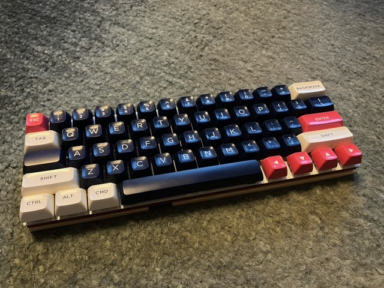

Makerdiary M60
======================



I got interested in the Makerdiary M60 because I wanted a 60% keyboard with dedicated, physical arrow keys in the lower-right corner. Most 60% keyboards I've seen, even ones with very powerful remapping capabilities, have a FN key in the lower-right which for safety reasons cannot be moved or remapped. When [the documentation](https://wiki.makerdiary.com/m60/configuration/#examples) said "If you already Python, configuring the keyboard is simple", I knew I had found the right board for me.

The M60 comes preloaded with very old firmware, and no instructions for how to get caught up with upstream CircuitPython. Thus, this howto!

# About

In this repo, you will find the configuration that I use on my own keyboard. It comes with a simple keymap and the following features:
* FN key on the left, between Tab and Shift (i.e. where Caps Lock usually goes)
* Arrow keys in the lower right, Left-Down-Up-Right
* `CIRCUITPY` drive and serial console hidden
  * Hold d (for "drive", natch) while plugging in the keyboard to make them available temporarily
* Keyboard-adjustable RGB lighting
  * FN-q to cycle through the presets
  * FN-ws to adjust brightness
  * FN-ad to adjust hue
* Alternate arrows available with FN-hjkl, just like vi
* ESC next to 1
  * tilde available with Shift-ESC
  * backtick available with FN-ESC
* F1-F12 available using FN on the number row
* A smattering of special keys in hopefully-obvious places

# Links

* [Makerdiary Store](https://makerdiary.com/products/m60-mechanical-keyboard-pcba)
* [Official Documentation](https://wiki.makerdiary.com/m60/)
* [Upstream Github](https://github.com/makerdiary/python-keyboard)
* [CircuitPython for M60](https://circuitpython.org/board/makerdiary_m60_keyboard/)

# Getting Started
## Update Bootloader

First, you will have to update UF2. Unfortunately, the M60 ships with a UF2 that predates the UF2 auto-updater. If you're already well-versed in Arduino development, you know what to do.

I'm new to Arduino, so I followed [the command-line update documentation](https://learn.adafruit.com/introducing-the-adafruit-nrf52840-feather/update-bootloader-use-command-line#update-bootloader-3108978).

On Ubuntu, I did it like this:
* Download [the newest UF2 .zip for m60](https://github.com/adafruit/Adafruit_nRF52_Bootloader/releases/)
```
        wget "https://github.com/adafruit/Adafruit_nRF52_Bootloader/releases/download/0.8.3/m60_keyboard_bootloader-0.8.3_s140_6.1.1.zip"
```
* Install `adafruit-nrfutil` into a virtualenv
```
        mkdir adafruit-nrfutil
        virtualenv adafruit-nrfutil
        ./adafruit-nrfutil/bin/pip3 install adafruit-nrfutil
* Update UF2 firmware
        ./adafruit-nrfutil/bin/adafruit-nrfutil --verbose dfu serial -p /dev/ttyACM0 -b 115200 --singlebank --touch 1200 --package m60_keyboard_bootloader-0.8.3_s140_6.1.1.zip
```
* Check that it worked
```
        cat "/media/${USERNAME}/M60KEYBOARD/INFO_UF2.TXT"
```

## Update CircuitPython

With UF2 updated, we can download the newest [CircuitPython for M60](https://circuitpython.org/board/makerdiary_m60_keyboard/) and copy it onto the M60KEYBOARD drive to install it.

For example:
```
        wget "https://downloads.circuitpython.org/bin/makerdiary_m60_keyboard/en_US/adafruit-circuitpython-makerdiary_m60_keyboard-en_US-8.2.9.uf2"
        cp adafruit-circuitpython-makerdiary_m60_keyboard-en_US-8.2.9.uf2 "/media/${USERNAME}/M60KEYBOARD/"
```

## Load python-keyboard

Now, we can load modules, code.py, and boot.py onto the keyboard by copying them onto the `CIRCUITPY` drive.

For example:
* Download the code
```
        git clone "https://github.com/tabbysable/python-keyboard.git"
```
* Copy `keyboard` module
```
        cp -r python-keyboard/keyboard/ "/media/${USERNAME}/CIRCUITPY/lib/"
```
* Install dependencies
```
        pip3 install -r python-keyboard/requirements.txt --no-deps -t "/media/${USERNAME}/CIRCUITPY/lib/"
```
* Copy `code.py` and `boot.py`, and make sure it finishes
```
	cp python-keyboard/{code,boot}.py "/media/${USERNAME}/CIRCUITPY/"
        sync
```
* Unplug / replug they keyboard and celebrate
  * You should see purple lights!

## Make It Your Own

Now that your keyboard is working, you may customize it by modifying `code.py` and `boot.py` according to your preferences. Hold d while plugging in the keyboard to make the `CIRCUITPY` drive visible, and do whatever sounds cool.

Good luck, and have fun!
